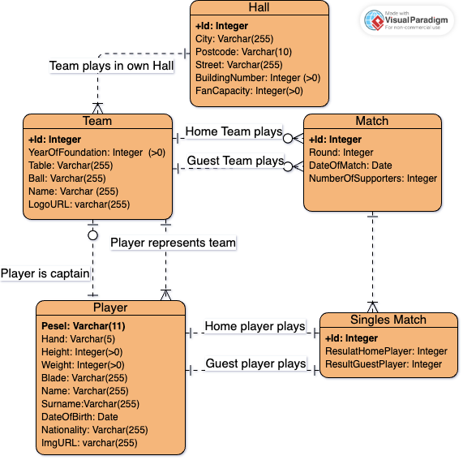

# webApp-TableTennisLeague

## Description
The website is about table tennis teams performing in the same league. Fans Table Tennis could see results of any matches, check stats teams and players. In addition, the site has a function for the administrator, who can, after logging in, add scheduled matches, add results, modify, etc.

'Game' - Match between two teams. In the 'Game' players play 'Single Matches'. The 'Game' is played to 3 wins 'Single Matches'. For a victory the team receives 2 points, for defeat only 1 point.

'SingleMatch' - Match between two players in sepcially 'Game'.

Admin data:

    Username: admin
    Password: admin123

### Authentication

Password is encrypted by **BCrypt Function** and is stored in database. After correct Authentication I generate JSON Web Token and save in LocalStorage. JWT has 10 min. time expiration.

### Authorization
In request to endpoints from Black_List *(/api/admin/\*)* I send JWT, which is located in LocalSotrage (Client-side).

## Requirements

- Java 8 or later
- Maven 3 or later
- Database (MySQL)

## Technologies
- Spring Boot
- Spring MVC
- MySql
- Lombok
- Spring JDBC
- Thymeleaf
- Flyway
- H2 
- Docker

## Database

### Entity-relationship diagram 

### Set up Database
Configure database according to application.properties file, or update this file with yours properties.

